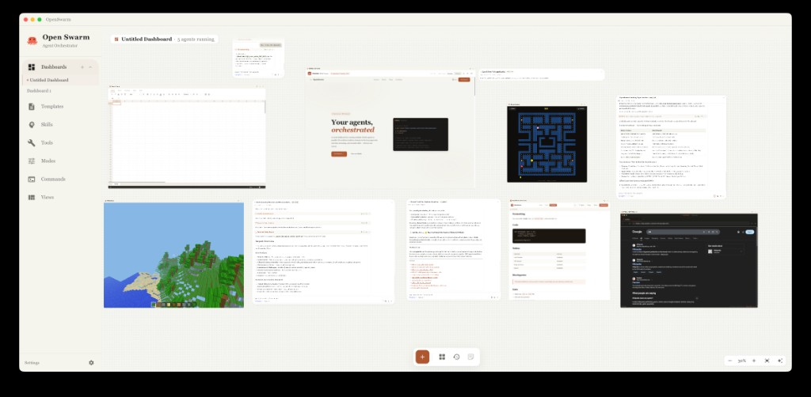

<p align="center">
  
</p>

<h1 align="center">Free Swarm</h1>

<p align="center">
  <strong>An Army of AI Agents at Your Fingertips</strong>
  <br>
  A locally-running orchestrator for managing multiple agents in parallel.
  <br>
  Launch, monitor, and coordinate entire swarms of coding agents from a single interface.
</p>

<p align="center">
  <a href="LICENSE"></a>
  <a href="#"></a>
  <a href="https://github.com/yethikrishna/free-swarm/stargazers"></a>
  <a href="https://github.com/yethikrishna/free-swarm/pulls"></a>
</p>

<p align="center">
  Built by <a href="https://myndlabs.tech"><strong>Mynd Labs</strong></a> &nbsp;·&nbsp; <a href="https://freeswarm.myndlabs.tech">freeswarm.myndlabs.tech</a>
</p>

<br>

<p align="center">
  
</p>

<br>

## Why Free Swarm?

Running agents in a terminal works fine for one task. But when you're juggling five agents across different branches, approving tool calls in separate windows, and losing track of who's doing what — it falls apart fast.

- **Parallel agents, one screen** — Launch as many agents as you need, arranged on a spatial canvas you can pan and zoom freely
- **Unified approval workflow** — Every tool-use request from every agent surfaces in one place. Approve or deny with a click or a keyboard shortcut.
- **Full conversation control** — Edit prior messages to fork conversations, navigate between branches, resume closed sessions
- **100% local** — Everything runs on your machine. No cloud relay, no telemetry, no third-party backend.

<br>

## Features

**Spatial Dashboard** — Infinite canvas with drag-and-drop agent cards, view cards, and embedded browser cards. Create multiple dashboards for different workspaces.

**Agent Chat** — Full streaming chat interface powered by WebSockets. Real-time token output, cost tracking per session, and persistent history that survives restarts.

**Human-in-the-Loop Approvals** — Agents request permission before executing tools. Approve or deny individually, or batch-approve from the dashboard. Configurable per-tool permissions (always allow, ask, deny).

**Message Branching** — Edit any prior message to fork the conversation. Navigate freely between branches without losing context.

**Built-in Browser** — Agents can control a real browser window. Watch them navigate, extract content, and interact with web pages in real time.

**App Builder** — Agents can scaffold and launch full web apps inside the interface. Live preview, persistent state, no context switching.

**MCP Support** — Connect any MCP server (filesystem, GitHub, Slack, and more). Full tool-use approval flow works with every server.

**Skills** — Create reusable, parameterized agent behaviors. Share and import them like packages.

<br>

## Getting Started

See [GETTING_STARTED.md](GETTING_STARTED.md) for detailed setup instructions.

**Quick start (macOS/Linux):**

```bash
git clone https://github.com/yethikrishna/free-swarm.git
cd free-swarm
./run.sh
```

**Quick start (Windows):**

```powershell
git clone https://github.com/yethikrishna/free-swarm.git
cd free-swarm
.\run.ps1
```

<br>

## Architecture

Free Swarm is built as an Electron desktop app with a local Python backend:

```
electron/     — Electron shell, window management, auto-updater
frontend/     — React/TypeScript UI (webpack)
backend/      — Python FastAPI server (agents, browser, MCP, settings)
```

The backend runs locally on your machine. No cloud relay is required; your API keys stay on your device.

<br>

## Web Version

The web version of Free Swarm is available at [freeswarm.myndlabs.tech](https://freeswarm.myndlabs.tech).

<br>

## Contributing

See [CONTRIBUTING.md](CONTRIBUTING.md) for contribution guidelines.

<br>

## About

Free Swarm is an open-source project by [Mynd Labs](https://myndlabs.tech).

<br>

## License

[MIT](LICENSE)
